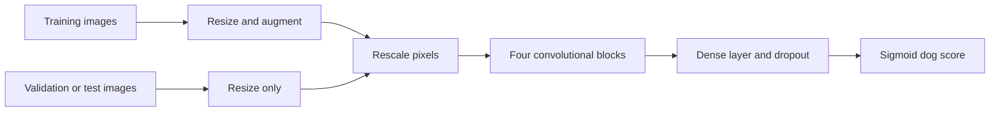

# Cat and dog classification with a convolutional neural network

[](https://github.com/fatemeh-akbarifar/fcc-image-classifier/actions/workflows/tests.yml)

A computer-vision project that distinguishes cats from dogs using a convolutional neural network trained from scratch. It demonstrates image ingestion, training-only augmentation, binary classification, validation-based checkpoint selection, and filename-aligned test evaluation.

## Original work

The original saved CNN run records **79.58% validation accuracy after 35 epochs**. This historical result is preserved with the notebook; it is not a newly reproduced test-set score.

[Original notebook and evidence](docs/original-work.md). The runnable edition below includes maintenance fixes; new validation numbers are kept separate from historical achievements.

## Run locally

```bash
git clone --depth 1 https://github.com/fatemeh-akbarifar/fcc-image-classifier.git
cd fcc-image-classifier
python3 -m venv .venv
source .venv/bin/activate
python -m pip install -r requirements.txt
python image_classifier.py
```

Use Python **3.9–3.11**; the automated workflow targets Python 3.11. On Windows, activate with `.venv\Scripts\activate`. A first run requires internet access for dependencies and missing datasets. Subsequent runs reuse local data. CPU execution is supported; neural-network training is slower without an accelerator.

Use a Python 3.9–3.11 kernel for the notebook; hosted runtimes with newer Python versions are outside the pinned environment. The verified execution path is the local command line.

Notebook: [Copy_of_fcc_cat_dog.ipynb](Copy_of_fcc_cat_dog.ipynb). [Open in Colab](https://colab.research.google.com/github/fatemeh-akbarifar/fcc-image-classifier/blob/main/Copy_of_fcc_cat_dog.ipynb).

## Method



1. Use the supplied splits: 2,000 training images, 1,000 validation images, and 50 numbered test images.
2. Resize to 150 × 150 RGB pixels. Apply random flips, rotations, zooms, and translations only during training.
3. Rescale pixels inside the model, then apply four convolution/max-pooling blocks with 32, 64, 128, and 256 filters.
4. Use a 512-unit dense layer, 50% dropout, and a sigmoid output, trained with Adam and binary cross-entropy.
5. Restore the best validation-loss weights. Evaluate every test image in numeric filename order (`1.jpg` through `50.jpg`) against the original challenge labels. The challenge threshold is 63%.

Class mapping: **0 = cat, 1 = dog**. Input to the saved model is RGB pixels in the 0–255 range, resized to 150 × 150. Rescaling is already included. All training and validation batches are consumed, including the final partial batch.

## Outputs

`artifacts/` contains `model.keras`, `metrics.json`, `history.json`, and `predictions.csv`. Generated artifacts and downloaded data are ignored by Git. The run also saves `training.png`. The dataset is downloaded automatically when missing and cached locally. Redundant dataset copies and macOS archive metadata are removed from the current Git tree; they remain recoverable in project history.

## Runnable-code checks

See [the reproducibility report](docs/validation.md) for measured results, commands, environment, and the limits of validation.

## Classify a new image

```python
import numpy as np
import tensorflow as tf

model = tf.keras.models.load_model("artifacts/model.keras", compile=False)
image = tf.keras.utils.load_img("example.jpg", target_size=(150, 150), interpolation="bilinear")
pixels = tf.keras.utils.img_to_array(image)
score = float(model(np.expand_dims(pixels, 0), training=False).numpy()[0, 0])
print({"label": "dog" if score >= 0.5 else "cat", "dog_score": score})
```

## Tests

```bash
python -m pip install -r requirements-dev.txt
python -m pytest -q
```

The included GitHub Actions workflow runs focused tests, including saved-model round trips where applicable. It does not retrain the full dataset on every push.

## Limitations

The 50-image test set is small and its labels are public. A single result has substantial uncertainty and is not a production benchmark. Validation controls early stopping; test labels are used only for final reporting. Sigmoid outputs are uncalibrated model scores. Augmentation differs from the original legacy ImageDataGenerator configuration.

## Project background and attribution

Developed by **Fatemeh Akbarifar** as part of freeCodeCamp's Machine Learning with Python projects. This repository packages and modernizes the original implementation with reusable Python entry points, dependency pins, tests, and reproducible evaluation. [Engineering notes](docs/engineering.md) distinguish original work from the reproducibility improvements.

- [freeCodeCamp project starter](https://github.com/freeCodeCamp/boilerplate-cat-and-dog-image-classifier)
- [Dataset used by the project](https://cdn.freecodecamp.org/project-data/cats-and-dogs/cats_and_dogs.zip)

The challenge design and supplied datasets are external resources; their original terms apply. No new dataset ownership or certification claim is made here.
